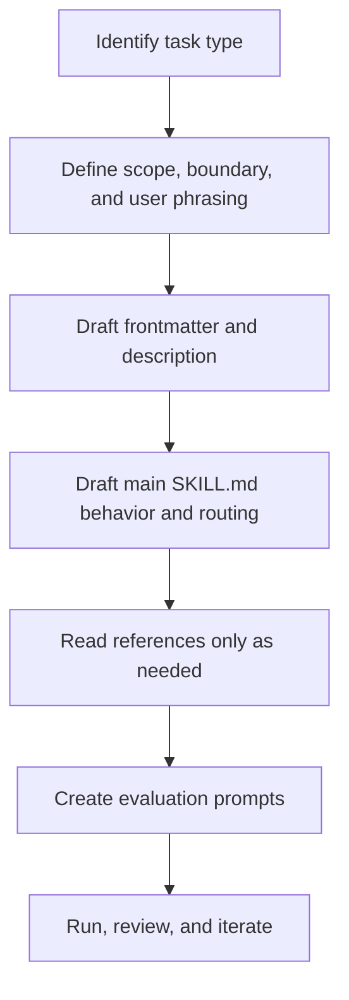

# 技术方案设计

## 概述

本方案将现有 `skills/skill-authoring/` 规范资产升级为一个可对外发布的公开 skill。源码继续维护在 `skills/skill-authoring/`，但内容、结构和语言风格都按照公开 skills 仓库的标准来组织。

该 skill 采用“主入口 + `references/` 渐进式披露”的结构：主 `SKILL.md` 负责定义 skill 的定位、触发边界、行为规则、路由和最小自检；详细规范、模板、评估方法和示例拆分到 `references/` 目录，供公开用户和 agent 按需读取。

## 目标

- 将当前 skill 全量改为专业英文内容
- 保持源码目录在 `skills/skill-authoring/`
- 使 skill 结构符合公开发布的 skill anatomy
- 提供可复用的 skill authoring 方法论，覆盖新建与优化两类场景
- 为后续发布流程提供稳定、可消费的目录与元信息结构

## 非目标

- 不在本阶段改造 MCP 工具、RAG 检索逻辑或技能解析协议
- 不统一重写现有全部 skills
- 不在本阶段绑定某一个特定的发布脚本实现细节

## 现有架构适配

当前仓库已有以下相关基础：

- `skills/` 可作为 skill 源码维护目录
- `config/.claude/skills/` 是现有对外 skill 形态的参考目录
- `scripts/build-skills-repo.mjs` 当前会消费 skill 目录与 `SKILL.md` frontmatter

因此本方案不改变源码维护目录，而是要求 `skills/skill-authoring/` 的结构与内容具备被发布流程消费的条件。

## 文件结构设计

目标目录结构如下：

```text
skills/skill-authoring/
├── SKILL.md
└── references/
    ├── frontmatter-patterns.md
    ├── structure-patterns.md
    ├── templates.md
    ├── evaluation.md
    └── examples.md
```

各文件职责：

- `SKILL.md`
  - 英文 frontmatter
  - 英文 skill 标题与简介
  - `When to use`、`Do NOT use for`
  - 行为规则、路由、最小自检
- `references/frontmatter-patterns.md`
  - `name`、`description` 编写方法
  - 关键词桶
  - precision / recall 权衡
- `references/structure-patterns.md`
  - skill anatomy
  - `references/`、`assets/`、`scripts/` 的职责与拆分阈值
  - 渐进式披露与 routing
- `references/templates.md`
  - 新建 skill 的行为模板
  - 旧 skill review 模板
  - 资源拆分模板
- `references/evaluation.md`
  - prompts 设计
  - run-and-review 闭环
  - acceptance dimensions 与 pass criteria
- `references/examples.md`
  - 正例、反例、改写示例

## 内容语言设计

该 skill 对外发布，因此内容层采用以下原则：

- 全部正文、标题、模板、示例、说明文字使用英文
- 避免仓库内部语境或中文说明残留
- 使用公开用户能直接理解的术语
- 保持所有 references 术语统一，例如 `trigger`, `routing`, `references`, `behavior`, `evaluation`

## 主 Skill 设计

主 `SKILL.md` 采用公开 skill 的标准形态：

- frontmatter 必须包含 `name` 与 `description`
- `description` 中显式使用 `This skill should be used when...`
- 正文明确 skill 会如何改变 agent 的行为
- routing 指向 `references/` 下的具体文档

建议主文档章节如下：

1. `What this skill does`
2. `When to use this skill`
3. `Do NOT use for`
4. `How to use this skill (for a coding agent)`
5. `Routing`
6. `Quick workflow`
7. `Minimum self-check`

## 公开发布导向的结构规范

为了让 skill 更适合公开分发，本方案要求：

- `SKILL.md` 保持精简，重点控制行为与路由
- 深度知识进入 `references/`
- 所有引用路径使用 skill 内相对路径
- 示例与模板使用对外口吻，而不是维护者视角

该结构也与 Anthropic `skill-creator` 所强调的渐进式披露和 examples/references 模式保持一致。

## 工作流设计

公开用户或 agent 使用该 skill 时，遵循以下流程：



### 新建 skill 流程

- 先定义目标任务、边界与真实用户表达
- 再编写 frontmatter 与主 `SKILL.md`
- 最后按复杂度补充 `references/` 中的模板、评估与示例

### 优化已有 skill 流程

- 先审查现有 `description`、行为规则与结构问题
- 找出触发不准、行为不稳或结构冗余的问题
- 用 evaluation prompts 复测并迭代改写

## 测试策略

本需求以内容验证和结构验证为主：

1. 结构验证
   - 确认 `skills/skill-authoring/` 目录与 `references/` 目录存在
   - 确认所有引用文件路径正确

2. 语言验证
   - 确认主 `SKILL.md` 与全部 references 使用英文
   - 确认没有中文说明和内部口吻残留

3. 内容验证
   - 用 should-trigger / should-not-trigger 样例检查触发边界
   - 确认评估文档包含 run-and-review 闭环与 pass criteria

4. 发布就绪验证
   - 确认 frontmatter 和目录结构适合被后续发布流程消费

## 安全性与维护性

- 本方案只修改文档型 skill，不涉及敏感凭证或执行权限变更
- 通过 `references/` 分层降低主文档体积，提升维护性
- 通过英文统一、模板统一和验收维度统一，降低后续公开维护成本

## 风险与缓解

风险：

- 英文翻译后丢失原有方法论准确性
- 对外文案仍残留内部仓库语气
- 发布结构看似对外化，但元信息不足以被消费

缓解方式：

- 逐文件英文改写，而不是机械翻译
- 统一术语和公开口吻
- 保留标准 frontmatter 和公开 skill anatomy
